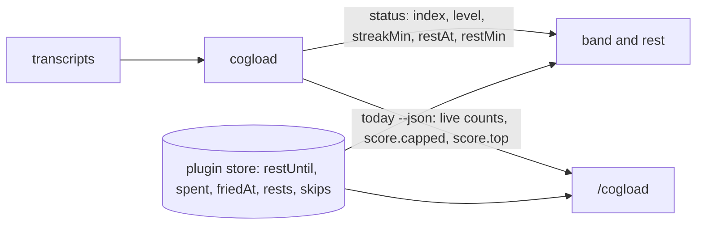

# Spec: every number the plugin shows comes from cogload

Extends `2026-09-19-zapara-status-file-design.md` (two new fields),
`2026-09-22-zapara-live-index-design.md` (the live streak),
`2026-10-04-zapara-forced-rest-design.md` and
`2026-10-05-cogload-explain-command-design.md` (where the plugin gets its
numbers). Everything not mentioned here stays as they say.

## Objective

The band, `/cogload` and the rest have shown different numbers for the same
moment, three times:
[#136](https://github.com/drakulavich/cogload/pull/136),
[#172](https://github.com/drakulavich/cogload/pull/172),
[#191](https://github.com/drakulavich/cogload/pull/191). Each time the plugin
had worked a number out again from its own copy of cogload's rules:

| In `plugin/hooks/register.ts` | Copy of |
|---|---|
| `WEIGHTS`, `BY_WEIGHT`, `capped`, `top` in `hourLine` | `WEIGHTS` and the part fractions in `src/lib/metrics/score.ts` |
| `REST_AFTER_MIN` (40) | `NORMS.streakMin` |
| `REST_MS` (10 min) | `GAP_MS` |
| `withBandStreak`, `streakStart` | the streak in `statusOf` |
| `streakWouldRest`, matching a streak start within `REST_MS` | the streak's start, which cogload knows exactly |

There are also two streaks. The band's streak is the one running now
(`status.streakMin`). The live score's streak is the longest one in the last
sixty minutes (`live.streakMin`). After a rest the band reads 0 while the score
still counts the old streak at the cap. #191 made `/cogload` quote the old one,
and #172 made it quote the band's.

After this change:

1. The plugin holds no number or formula from `src/lib/metrics`. It reads
   them from `cogload status` and `cogload today --json`.
2. One streak. The live score counts the streak running at `asOf`, the same
   minutes as `status.streakMin`. After a rest, the streak part of the live
   index drops to 0 with the band.
3. A break cools the live index. After a break longer than `GAP_MS`, the load
   from before it counts at `w = max(0, 1 − break / 20 min)`: an 11-minute
   break keeps 45% of it, 20 minutes or more keeps none. A pause of
   `GAP_MS` or less is no break and keeps all of it. While the break is still
   going, its length so far counts, so the band cools during a rest.
4. The rules about the person stay in the plugin and keep their numbers. That
   covers which reading starts a rest, Fried once an hour (`HOUR_MS`), the
   week's count (`WEEK_MS`), `skip:` and its three words, the phrases, and
   every sentence it prints. Those rules don't depend on how cogload measures.

Not in scope:
- the band's look;
- `skip:` parsing;
- the DST hour ([#148](https://github.com/drakulavich/cogload/issues/148)),
  which is inside cogload and gets no help from a single source;
- having cogload print the plugin's sentences.

### How

**Status file: two fields** (`schema` stays 1, because adding a field does not
bump it):

| Field | Meaning |
|---|---|
| `restAt` | When the running streak reaches `NORMS.streakMin`: its first action plus 40 minutes, ISO 8601 UTC. `null` when `streakMin` is 0. The value stays the same for the whole streak, so it also names the streak. |
| `restMin` | How long a rest must be to end a streak: `GAP_MS` in minutes, `10`. |

`statusOf` computes both from `presence.streakStartAt`. The privacy line of
the status spec changes from "these nine values" to "these eleven values".
Both new fields are a time and a constant, with nothing about a person's work.

**Score: what drives it.** `Score` gains `capped: Part[]` and `top: Part`.
`capped` lists the parts at their full weight, heaviest first. `top` is the
part closest to its weight, by the comparison `hourLine` makes today.
`score()` computes both from the fractions it already has. They reach
`today --json` through `live.score`, and every hour bucket carries them too.

**Live streak.** For the live bucket only, `finish` takes `streakMin` from
`presence` against `now`, by the rule `statusOf` uses. That is the minutes
from `streakStartAt` to `now` when `lastAt` is within `GAP_MS` of `now`, and
0 otherwise. Hour buckets keep the longest streak in the hour, because they
describe a past hour, not now.

**Cooling.** For the live bucket only. Take two scores, both with the running
streak:
- `full`, the sixty minutes ending at `now`, as today;
- `after`, the same window but starting at the running streak's first action.
  When no streak is running (`now − lastAt > GAP_MS`), `after` holds nothing
  and scores 0.

The break is the time between the last action before the running streak and
its first action. While no streak is running, it is `now − lastAt`. When no
action precedes it in what cogload read, the break is long and `w` is 0. Then
`w = 1` for a break of `GAP_MS` or less, and `max(0, 1 − break / 20 min)`
otherwise. Each part's fraction is `after + w × (full − after)`. The index,
level, `capped` and `top` come from those fractions by the rules of `score()`.
`20 min` is a new norm, `NORMS.coolMin`, next to the others in `score.ts`.
`status.index`, `level` and `peak` follow the live index as they do today.
Hour buckets do not cool.

**Plugin.**
- `decodeStatus` requires `restAt` (an ISO instant or `null`) and `restMin`
  (an integer 1..60).
- A rest is due when `restAt` is not `null` and `asOf >= restAt`, or by the
  Fried rule as now.
- `spent` stores the `restAt` of the streak that rested. The same streak is
  the same string, so no tolerance is needed.
- A rest lasts `restMin` minutes.
- The band's "rest at" is `clockTime(restAt)`.
- `/cogload` builds its line from `live.score.capped`, `live.score.top` and
  `live`'s counts. `withBandStreak` and the `hourStreakMin` argument go away.
- If the reading lacks `restAt`, or `/cogload` gets a score without `capped`,
  cogload is older than the plugin. The plugin then shows once
  `cogload is older than this plugin: bun add -g @drakulavich/cogload@latest`
  and no band. `/cogload` prints the same text.
- `REST_AFTER_MIN`, `REST_MS`, `WEIGHTS`, `BY_WEIGHT`, `withBandStreak` and
  `streakStart` are deleted.



**Release order.** cogload 0.13.0 ships first. Plugin 0.10.0 needs it, and
`docs/reference.md` says so.

## Tech Stack

As the specs above: cogload in Bun and TypeScript, the plugin's function
hooks in plain TypeScript.

## Commands

```
bun run check
claude plugin validate plugin
claude plugin test plugin
```

## Project Structure

```
src/lib/types.ts                    Score.capped, Score.top
src/lib/metrics/score.ts            computes capped and top
src/lib/metrics/derive.ts           live streakMin from presence
src/lib/status/status.ts            restAt, restMin
tests/...                           cogload cases below
plugin/hooks/register.ts            reads the new fields, loses the copies
plugin/tests/register.test.ts       plugin cases below
docs/superpowers/specs/2026-09-19-zapara-status-file-design.md   two fields, eleven values
docs/reference.md                   the status fields; plugin needs cogload 0.13.0
package.json                        0.13.0 at the release PR
plugin/.claude-plugin/plugin.json   0.9.2 → 0.10.0
```

## Testing Strategy

cogload, through `analyze()` or the CLI with fixtures in the real transcript
format. Each case fails without its change:

1. `status` 25 minutes into a streak gives `restAt` = its first action + 40
   min and `restMin` 10. After 11 minutes away, `restAt` is `null`.
2. Two `status` runs 5 minutes apart in one streak give the same `restAt`.
3. A score with streak and parallel at their weight has
   `capped` = `["parallel", "streak"]`. A score with nothing capped has
   `top` = the part closest to its weight.
4. A 44-minute streak, an 11-minute break (one past `GAP_MS`), and 10 minutes of work: the live
   bucket's `streakMin` is 10 and equals `status.streakMin`. Today it is 44.
4a. Cooling, same fixture shape with a busy 40 minutes before the break:
   - a 5-minute pause leaves the live index as `full`;
   - an 11-minute break gives `after + 0.45 × (full − after)` in every part;
   - a 20-minute break gives `after`;
   - 15 minutes into a break with no action yet gives `0.25 × full`.
   Each value differs from today's live index.

Plugin, `claude plugin test plugin`:

5. A rest starts when `asOf` reaches `restAt` and not a minute earlier. It
   lasts `restMin`.
6. The same `restAt` after a rest starts no second rest. A new `restAt`
   starts one.
7. The band's "rest at" shows `restAt` in local time.
8. `/cogload` names the parts in `capped`, in that order, and otherwise `top`.
   The fixture's `capped` must differ from what the plugin's old `WEIGHTS`
   would pick, so the test proves the plugin reads the field.
9. A status line without `restAt` shows the "older than this plugin" text
   once and no band.

The #191 case "after a rest, the streak at the cap is the hour's" is removed.
Case 4 replaces it: after a rest no streak is at the cap.

## Boundaries

- Always: privacy as in CLAUDE.md. The new fields are a time and a constant.
- Ask first: changing 40 minutes, 10 minutes or a weight. Each lives only in
  `src/lib/metrics` after this change.
- Never: a number from `src/lib/metrics` copied into `plugin/`.

## Definition of Done

- `grep -nE "REST_AFTER_MIN|REST_MS|WEIGHTS|withBandStreak|streakStart\b" plugin/hooks/register.ts`
  prints nothing.
- `bun run check` passes, cases 1 to 4a included, each failing without its
  change.
- `claude plugin test plugin` passes, cases 5 to 9 included, each failing
  without its change.
- `claude plugin validate plugin` passes.
- In one session after a rest, the band, `/cogload` and `cogload status` show
  the same streak, and `/cogload` names no streak at the cap.
- The status file spec lists `restAt` and `restMin` and says eleven values.
- The live-index and forced-rest specs point here.
- Plugin 0.10.0. The PR body carries the CHANGELOG lines for cogload 0.13.0
  and plugin 0.10.0.

## Follow-up

- With cooling, a Fried rest no longer meets a Fried reading ten minutes
  later, so the plugin's "Fried once an hour" rule (#181) may have nothing
  left to do. An issue after this lands, not part of it.
